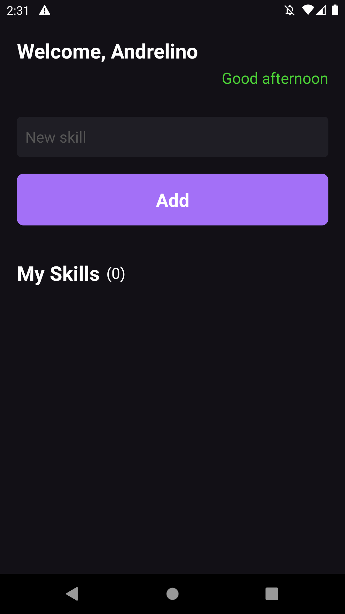
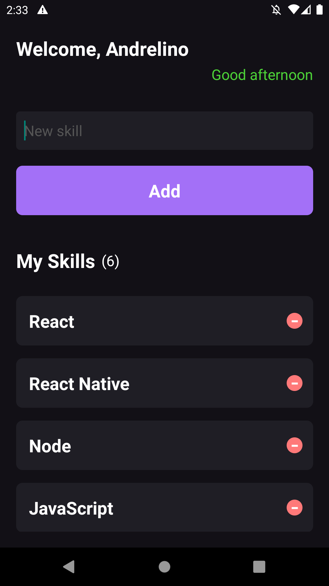
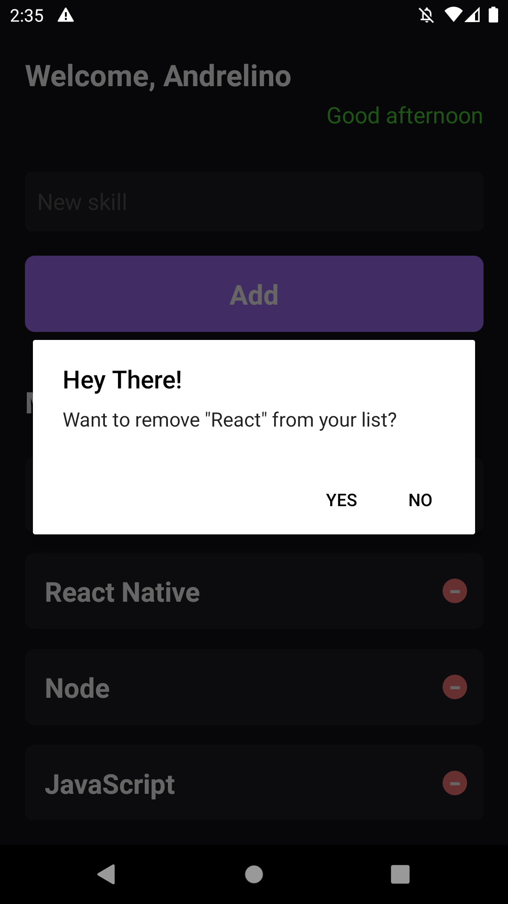
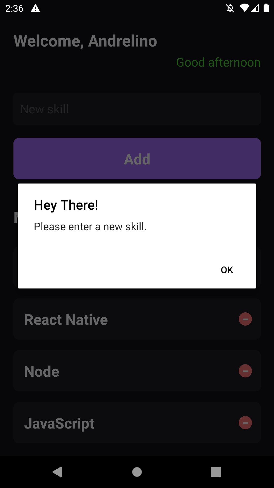
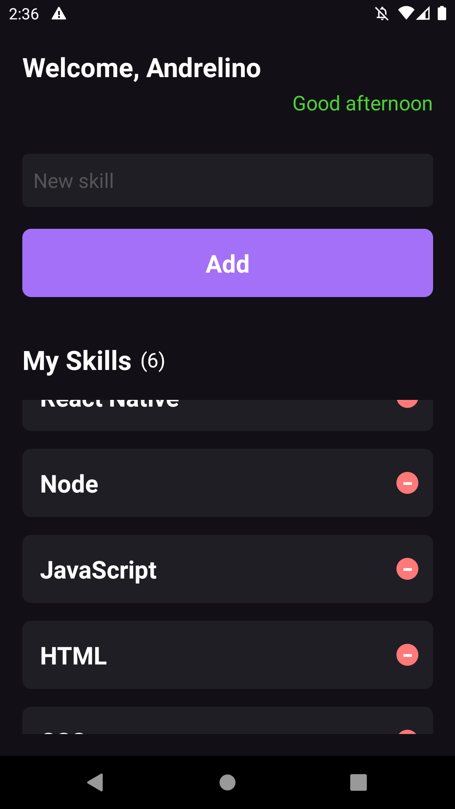

# MySkills

**Info**

_Ignite > Trilha React Native | Projeto desenvolvido nas aulas do Chapper I: Fundamentos React Native._

---
**Recomendado**:

Conheça o **[Ignite](https://rocketseat.com.br/ignite)** da [Rocketseat](https://github.com/Rocketseat) com os melhores conteúdos e métodos para quem quer realmente aprender a aprender programação (#NeverStopLearning).

---
Neste capítulo desenvolvemos um projeto simples de lista de skills. No qual compreendemos a estrutura de um projeto React Native com a CLI além de conhecer os principais conceitos por volta da bibliotera como componentes, propriedades, estado, imutabilidade, hooks, estilização do TypeScript. 

## Telas do App
- Home do App


<br />

- Listagem de skills


<br />

- Removendo skill da lista


<br />

- Verificando input vazio


<br />

- Rolagem de página


### Principais tecnologias usadas
- [React](https://reactjs.org)
- [React Native](https://reactnative.dev)
- [TypeScript](https://www.typescriptlang.org)

**debug**
- [Flipper](https://fbflipper.com)

## Como baixar o App para sua máquina
1. Acesso terminal do seu sistema operacional (Windows, Linux, Mac).
2. Acesse a pasta de seus projetos
```bash
# Exemplo
$ cd ~\www\projetos
```
3. Estando dentro da página, clone o projeto usando o GIT:
```bash
$ git clone https://github.com/andrelinos/MySkills.git

$ cd MySkills
```
4. Pronto, neste passo você já terá o projeto em sua mágina e pronto para você testar. 

## Como rodar o App
Para o rodar o App é bem simples. Bastanto apenas executar os seguintes comandos abaixo: 
```bash
$ yarn start # Necessário para iniciar o App

$ yarn android  # Necessário para executar o App 
                # no seu emulador ou dispositivo físico.
```
**Notas**: 
1. Se você não tiver ou não quiser usar o ``yarn``, pode usar também os ``npm run start`` ou ``npm run android``, que vai funcionar da mesma forma.
2. Sempre é voce executar primeiro o comando para iniciar a aplicação e depois rodar no emulador. 
3. 


**Nota**: Cecessário vocêr ter um emulador Android eu seu computador ou um emulador iOS em seu Mac. 
<br /> 

---
<br />

## Autor
<a href="https://app.rocketseat.com.br/me/andrelinosilva">
<kbd>
  
</kbd>
<br /><b>
Andrelino Silva 🚀</b></a>

<p>
    Sou apaixonado por tecnologias e quero muito criar coisas grandes e de ajudar as pessoas. Estou na luta para estudar e conciliar família, estudos, trabalho.
</p>


  | Rede social | Saiba mais |
  | --- | --- |
  | GitHub | [https://github.com/andrelinos](https://github.com/andrelinos) |
  | Linkedin | [https://linkedin.com// in/andrelinosilva](https://linkedin.com/in/andrelinosilva) |
  | Twitter| [https://twitter.com/ _andrelinosilva](https://twitter.com/_andrelinosilva) |
  | Facebook | [https://facebook.com/ andrelinossilva](https://facebook.com/andrelinossilva/) |
  | Instagram| [https://instagram.com/andrelinossilva](https://instagram.com/andrelinossilva/) |
  | Youtube | [https://youtube.com/ c/AndrelinoSilvas](https://youtube.com/c/AndrelinoSilvas/) |
  | Rocketseat | [https://app.rocketseat.com.br/ me/andrelinosilva](https://app.rocketseat.com.br/me/andrelinosilva) |

</div>
</div>
</div>
<br>

---
<p align="center">Made with 💜 by Andrelino Silva</p>
